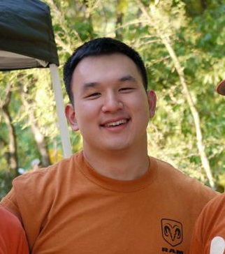

## Dennis Kim (김인현)
_MS in Computer Science, DePaul University \
MS in Mathematical Sciences, NYU_

---

**Success is no accident. It is hard work, perseverance, learning, studying, sacrifice, and most of all, love of what 
you are doing or learning to do.** - Pelé

**Success is nothing more than a few disciplines, practiced every single day.** - Mel Robbins

---

#### ABOUT ME:

Hello, my name is Dennis Kim, and I was born and raised in Houston, TX. I am an aspiring quantitative researcher, 
seeking positions with firms that share my appreciation for quantitative rigor.

My interest in the space developed after the 2008 crisis, which introduced me to the fascinating world of 
decision sciences where I have focused much of my academic work to date. Briefly speaking, I started my career in oil &
gas, migrated to commercial banking and wealth management, and now find myself in pursuit of a PhD (program TBD). 

My desired PhD goals are to further explore existing data science techniques, both qualitative and quantitative, while
adding additional tools to the contemporary decision-maker's toolbelt. I aim to do the latter by expanding the capabilities
of reinforcement learning methodologies. RL is a personally fascinating approach and perspective to problem-solving, 
specifically those that are multiperiod in nature. Current approaches draw from a variety of disciplines like math, CS,
and statistics. Unsurprisingly, I have focused my academic work on that material (please see skills below). Ultimately,
I hope to make policy discovery more versatile across dynamic environments/data feeds and improve the 
exploration-exploitation problem. 

Otherwise, I enjoy cooking (slow-cooking/neopolitan style pizzas), learning to skateboard and play bass guitar, 
walking my dog (Bert), and learning in general. 

#### CODING SKILLS:

Languages: Python, Java, C, R \
RDBMS: SQL \
Platforms/Tools: AWS, Docker, Kubernetes \
Libraries: SciPy, NumPy, Pandas, Scikit-learn, Statsmodels, Selenium, PyTorch \
Paradigms: OOP/SOLID

#### ACADEMIC DISCIPLINES:

Computer Science (primary focus in software engineering and data science) \
Mathematical Sciences (focus on financial applications)

<!--
**DKMaCS/DKMaCS** is a ✨ _special_ ✨ repository because its `README.md` (this file) appears on your GitHub profile.

Here are some ideas to get you started:

- 🔭 I’m currently working on ...
- 🌱 I’m currently learning ...
- 👯 I’m looking to collaborate on ...
- 🤔 I’m looking for help with ...
- 💬 Ask me about ...
- 📫 How to reach me: ...
- 😄 Pronouns: ...
- ⚡ Fun fact: ...
-->
