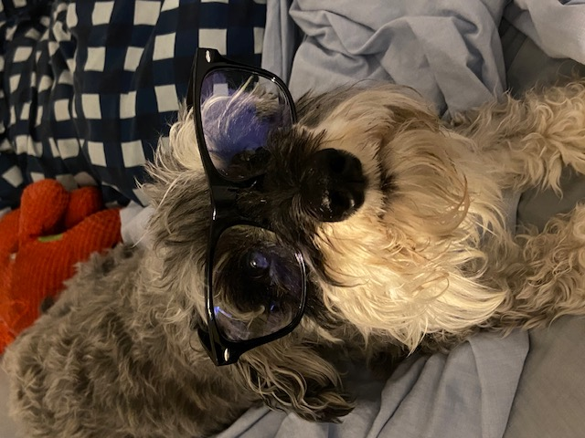

## Dennis Kim (김인현), CFA 
[Resume](https://dkmacs.github.io/)
[Wyzant](https://www.wyzant.com/Tutors/dktutorsforfun/)

_PhD Candidate in Computer Science, Colorado State University \
MS in Mathematical Sciences, NYU \
MS in Computer Science, DePaul University_

---

**Life isn't about finding yourself. It's about creating yourself.** - George Bernard Shaw

**[Success is nothing more than a few disciplines, practiced every single day.](https://twitter.com/melrobbins/status/943992733924057088/)** - Mel Robbins

---

#### ABOUT ME:

Hello, my name is Dennis Kim, and I was born and raised in Houston, TX. I am an aspiring quantitative researcher, 
seeking internship positions with firms that share my appreciation for quantitative rigor.

My interest in the space developed after the 2008 crisis, which introduced me to the fascinating world of 
decision sciences where I have focused much of my academic work to date. Briefly speaking, I started my career in oil &
gas, migrated to commercial banking and wealth management before returning to school, and now find myself in pursuit 
of a PhD (Colorado State University). 

My desired PhD goals are to further explore existing data science techniques, both qualitative and quantitative, while
adding additional tools to the contemporary decision-maker's toolbelt. I aim to accomplish the latter by expanding the capabilities
of reinforcement learning methodologies. RL is a personally intriguing approach and perspective to problem-solving, 
specifically those that are multiperiod in nature. Current approaches draw from a variety of disciplines like math, CS,
and statistics. Unsurprisingly, I have focused my academic work on that material (please see skills/academics below). 
Ultimately, I hope to make policy discovery more versatile across dynamic environments/data feeds and improve the 
exploration-exploitation problem. 

Otherwise, I enjoy cooking (slow-cooking/neopolitan style pizzas), learning to skateboard and play bass guitar, 
walking my dog [(Bert)](https://github.com/DKMaCS#bert), and learning in general. 

#### CODING SKILLS:

Languages: Python, Java, C, R, SQL \
Platforms/Tools: AWS, Docker, Kubernetes, PyCharm, IntelliJ \
Libraries: SciPy, NumPy, Pandas, Scikit-learn, Statsmodels, Selenium, PyTorch, statistics, pymc3 \
Paradigms: OOP/SOLID

#### ACADEMICS:

Coursework: Machine Learning, Neural Networks, Big Data Mining, Linear Algebra, Real Analysis, Natural Language
Processing, Time Series Analysis, Stochastic Modeling, Quantitative Trading & Algorithmic Strategies, 
Statistical Inference & Regression (including L1 and L2),
GAAP/IFRS conventions

#### OTHER:

CFA Charterholder (2019 designation)

#### BERT:

<!--
**DKMaCS/DKMaCS** is a ✨ _special_ ✨ repository because its `README.md` (this file) appears on your GitHub profile.
-->
